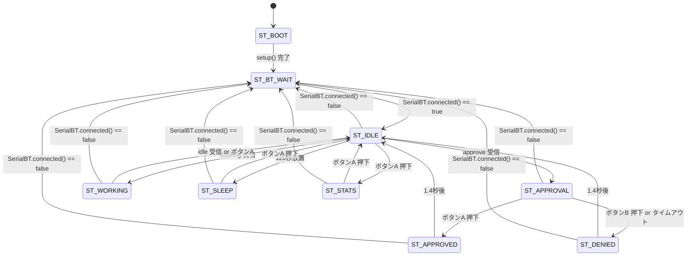

# 設計 — Bluetooth SPP 対応

## 1. 実装アプローチ

変更対象は `src/boo_device.ino` のみ。`boo_bridge.py` / `docs/` は変更なし。

変更方針は **最小差分**。既存の描画関数・パラメータ処理・ボタンロジックはそのまま流用し、
以下の 7 点に絞って変更・追加する。

| # | 変更種別 | 対象 |
|---|---------|------|
| 1 | 追加 | `#include <BluetoothSerial.h>` / 定数 `BT_DEVICE_NAME` / `BT_PIN` |
| 2 | 追加 | グローバル変数 `BluetoothSerial SerialBT` |
| 3 | 追加 | `DeviceState` に `ST_BT_WAIT` |
| 4 | 追加 | `ART_BT_WAIT` アスキーアート定数 |
| 5 | 追加 | 関数 `drawBtWaitScreen()` / `checkBtConnection()` |
| 6 | 変更 | `sendJson()` の `Serial` → `SerialBT` 置換 |
| 7 | 変更 | `pollSerial()` を `pollBt()` にリネームし `SerialBT` に置換 |
| 8 | 変更 | `setup()` / `loop()` への BT 初期化・接続チェック組み込み |
| 9 | 変更 | `bootAnimation()` のバージョン文字列 `v2.0` → `v2.1` |
| 10 | 変更 | `drawIdleScreen()` への BT インジケーター追加（アイドル画面のみ） |

---

## 2. 更新後の状態遷移図



---

## 3. 各変更の詳細設計

### 3-1. ファイルヘッダー・`#include`・定数（ファイル先頭）

**変更前：**
```cpp
/**
 * boo_device.ino  v2.0
 * ■ 通信プロトコル: JSON over USB Serial (115200bps)
 */

#include <M5StickCPlus2.h>
#include <ArduinoJson.h>

#define SERIAL_BAUD     115200
#define IDLE_SLEEP_SEC  120
```

**変更後：**
```cpp
/**
 * boo_device.ino  v2.1
 * ■ 通信プロトコル: JSON over Bluetooth Classic SPP
 *   USB Serial (115200bps) はデバッグ出力専用
 */

#include <M5StickCPlus2.h>
#include <ArduinoJson.h>
#include <BluetoothSerial.h>        // 追加

#define SERIAL_BAUD     115200
#define IDLE_SLEEP_SEC  120
// ---- Bluetooth ----              // 追加ブロック
#define BT_DEVICE_NAME  "BooDevice"
#define BT_PIN          "1234"
```

### 3-2. グローバル変数（`DeviceState` 定義の直前）

**変更前：**
```cpp
enum DeviceState {
  ST_BOOT, ST_IDLE, ST_SLEEP,
  ST_APPROVAL, ST_WORKING,
  ST_APPROVED, ST_DENIED, ST_STATS
};
```

**変更後：**
```cpp
BluetoothSerial SerialBT;           // 追加（グローバル変数セクションの先頭に置く）

enum DeviceState {
  ST_BOOT, ST_BT_WAIT,             // ST_BT_WAIT を追加
  ST_IDLE, ST_SLEEP,
  ST_APPROVAL, ST_WORKING,
  ST_APPROVED, ST_DENIED, ST_STATS
};
```

`BluetoothSerial SerialBT` は他のグローバル変数（`gState`, `gBoo` など）より前、
ファイルのグローバルスコープ先頭に宣言する。

### 3-3. `ART_BT_WAIT` アスキーアート定数

既存の `ART_TIRED` の直後に追加する。

```cpp
// ---- Bluetooth 接続待ち ----
const AsciiArt ART_BT_WAIT = {{
  "   .-\"\"-.   ", "  / - ~ - \\  ",
  " |   ...   | ", "  \\ _____ /  ", " waiting...  ",
}, 5, COL_DIM};
```

### 3-4. `drawBtWaitScreen()` 新設

既存の `drawStatsScreen()` の直後（`bootAnimation()` の前）に追加する。

```cpp
// ============================================================
// 画面描画 — Bluetooth 接続待ち
// ============================================================
void drawBtWaitScreen() {
  cls();
  drawArt(ART_BT_WAIT, MASCOT_Y);
  hline(82);
  drawText(4,  88, COL_INFO, 1, BT_DEVICE_NAME);
  // gFlash で "waiting BT..." と空白を交互に表示（600ms 点滅）
  drawText(4, 100, COL_DIM,  1, gFlash ? "waiting BT..." : "             ");
  drawText(4, 112, COL_DIM,  1, "pair PIN: " BT_PIN);
  hline(124);
  drawText(4, 130, COL_DIM,  1, "connect via");
  drawText(4, 140, COL_BOO,  1, "Bluetooth SPP");
}
```

**レイアウト（135×240px）：**

```
y=  8  ART_BT_WAIT（アスキーアート、COL_DIM）
y= 82  水平線
y= 88  "BooDevice"      (COL_INFO / 白)
y=100  "waiting BT..."  (COL_DIM / 点滅、600ms)
y=112  "pair PIN: 1234" (COL_DIM)
y=124  水平線
y=130  "connect via"    (COL_DIM)
y=140  "Bluetooth SPP"  (COL_BOO / シアン)
```

### 3-5. `checkBtConnection()` 新設

`drawBtWaitScreen()` の直後に追加する。

```cpp
// ============================================================
// Bluetooth 接続状態チェック（loop() 冒頭で毎フレーム呼び出す）
// ============================================================
void checkBtConnection() {
  bool connected = SerialBT.connected();

  // 接続中 → 切断を検知: ST_BT_WAIT へ遷移
  if (!connected && gState != ST_BT_WAIT && gState != ST_BOOT) {
    Serial.println("[debug] BT disconnected");
    gState = ST_BT_WAIT;
    drawBtWaitScreen();
    return;
  }

  // 切断中 → 再接続を検知: ST_IDLE へ遷移
  if (connected && gState == ST_BT_WAIT) {
    Serial.println("[debug] BT reconnected");
    gState      = ST_IDLE;
    gLastIdleMs = millis();
    drawIdleScreen();
  }
}
```

**設計上の判断：**
- `ST_APPROVAL` 中に切断した場合、`gReq` はリセットしない。再接続後は `ST_IDLE` へ戻るため、
  古い `gReq` が画面に表示されることはない。PC 側は `asyncio.TimeoutError` で `approved=false` を返す（既存実装）。
- `ST_APPROVED` / `ST_DENIED` 中に切断した場合も `ST_BT_WAIT` へ遷移する。
  承認結果の JSON はボタン押下時に即送信済みのため、データ欠損は発生しない。
- `ST_SLEEP` 中の切断も検知する。スリープで回復した `energy` は `gBoo.energy` に保持されるため失われない。

### 3-6. `sendJson()` 変更

`Serial` を `SerialBT` に置換。デバッグログは `Serial.printf` で残す。

**変更前：**
```cpp
void sendJson(bool approved) {
  StaticJsonDocument<64> doc;
  doc["approved"] = approved;
  serializeJson(doc, Serial);
  Serial.println();
}
```

**変更後：**
```cpp
void sendJson(bool approved) {
  StaticJsonDocument<64> doc;
  doc["approved"] = approved;
  serializeJson(doc, SerialBT);   // SerialBT に変更
  SerialBT.println();             // SerialBT に変更
  Serial.printf("[debug] sent approved=%s\n", approved ? "true" : "false");
}
```

### 3-7. `pollSerial()` → `pollBt()` リネーム＆変更

関数名を `pollBt()` に変更し（責務が `SerialBT` の読み取りのため）、
`Serial.available()` / `Serial.read()` を `SerialBT` に置換。
`ST_BT_WAIT` 中はガードで早期リターン。

`loop()` 内の呼び出し箇所も `pollSerial()` → `pollBt()` に合わせて変更する。

**変更前：**
```cpp
void pollSerial() {
  while (Serial.available()) {
    char c = (char)Serial.read();
    ...
  }
}
```

**変更後：**
```cpp
void pollBt() {
  if (gState == ST_BT_WAIT) return;          // 接続待ち中はスキップ
  while (SerialBT.available()) {             // SerialBT に変更
    char c = (char)SerialBT.read();          // SerialBT に変更
    ...  // バッファ処理は変更なし
  }
}
```

### 3-8. `setup()` 変更

BT 初期化を追加し、初期ステートを `ST_BT_WAIT` に変更。

**変更前：**
```cpp
void setup() {
  auto cfg = M5.config();
  M5.begin(cfg);
  M5.Lcd.setRotation(0);
  M5.Lcd.setBrightness(160);
  M5.Lcd.fillScreen(COL_BG);
  Serial.begin(SERIAL_BAUD);

  uint32_t now      = millis();
  gBoo.sessionStart = now;
  gLastIdleMs       = now;
  gLastFrameMs      = now;
  gLastDecayMs      = now;

  bootAnimation();
  gState = ST_IDLE;
  drawIdleScreen();
}
```

**変更後：**
```cpp
void setup() {
  Serial.begin(SERIAL_BAUD);              // デバッグ用 ※ M5.begin より前に呼ぶ
  auto cfg = M5.config();
  M5.begin(cfg);
  M5.Lcd.setRotation(0);
  M5.Lcd.setBrightness(160);
  M5.Lcd.fillScreen(COL_BG);
  SerialBT.setPin(BT_PIN, 4);             // 追加: PIN 設定（begin より前に呼ぶ）※ 2 引数版
  SerialBT.begin(BT_DEVICE_NAME);         // 追加: BT SPP 開始

  uint32_t now      = millis();
  gBoo.sessionStart = now;
  gLastIdleMs       = now;
  gLastFrameMs      = now;
  gLastDecayMs      = now;

  bootAnimation();
  gState = ST_BT_WAIT;                     // 変更: ST_IDLE → ST_BT_WAIT
  drawBtWaitScreen();                      // 変更: drawIdleScreen() → drawBtWaitScreen()
}
```

**`SerialBT.setPin()` を `begin()` より前に呼ぶ理由：**
ESP32 Arduino の `BluetoothSerial` では、`setPin()` は `begin()` 呼び出し前に設定する必要がある。
逆順だと PIN が反映されない。

### 3-9. `loop()` 変更

`checkBtConnection()` 呼び出しの追加、アニメーション switch への `ST_BT_WAIT` ケース追加、
`ST_BT_WAIT` 中の以降処理スキップガードの追加。

**変更前：**
```cpp
void loop() {
  M5.update();
  pollSerial();
  uint32_t now = millis();

  tickDecay(now);

  if (now - gLastFrameMs >= ANIM_INTERVAL) {
    gAnimIdx++;
    gLastFrameMs = now;
    gFlash = !gFlash;
    switch (gState) {
      case ST_IDLE:     drawIdleScreen();     break;
      case ST_SLEEP:    drawSleepScreen();    break;
      case ST_APPROVAL: drawApprovalScreen(); break;
      case ST_WORKING:  drawWorkScreen();     break;
      default: break;
    }
  }
  // ... 以降のボタン・タイムアウト処理
```

**変更後：**
```cpp
void loop() {
  M5.update();
  checkBtConnection();             // 追加: BT 切断/再接続を毎フレーム検知
  pollBt();                        // 変更: pollSerial() → pollBt()
  uint32_t now = millis();

  tickDecay(now);

  if (now - gLastFrameMs >= ANIM_INTERVAL) {
    gAnimIdx++;
    gLastFrameMs = now;
    gFlash = !gFlash;
    switch (gState) {
      case ST_BT_WAIT:  drawBtWaitScreen();  break;  // 追加
      case ST_IDLE:     drawIdleScreen();    break;
      case ST_SLEEP:    drawSleepScreen();   break;
      case ST_APPROVAL: drawApprovalScreen(); break;
      case ST_WORKING:  drawWorkScreen();    break;
      default: break;
    }
  }

  if (gState == ST_BT_WAIT) return;  // 追加: 接続待ち中は以降の処理をスキップ

  // ... 以降のボタン・タイムアウト処理（変更なし）
```

**`if (gState == ST_BT_WAIT) return` を置く位置：**
アニメーション更新ブロックの直後。`checkBtConnection()` と `tickDecay()` は `ST_BT_WAIT` 中も実行する。
- `checkBtConnection()` : 再接続の検知が必要なため実行する
- `tickDecay()` : 接続待ち中も `fed` の自然減衰と `energy` のアイドル微減を継続する（`default` ケースが適用される）
- アニメーション（`drawBtWaitScreen()`）: 点滅表示のため実行する
- ボタン処理・承認タイムアウト・スリープ遷移: 接続なしでは不要なためスキップ

### 3-9. `bootAnimation()` バージョン文字列更新

`bootAnimation()` 内の起動画面テキストを更新する。

**変更前：**
```cpp
M5.Lcd.setCursor(20, 96); M5.Lcd.print("v2.0  M5StickC+2");
```

**変更後：**
```cpp
M5.Lcd.setCursor(20, 96); M5.Lcd.print("v2.1  M5StickC+2");
```

### 3-10. `drawIdleScreen()` への BT インジケーター追加

**スコープの決定（v2.1）：アイドル画面のみ**

要件 CONN-06 は "接続中はインジケーターを表示" と定義しているが、
承認画面・作業中画面・スタッツ画面はそれぞれ画面領域が専有されておりインジケーター追加で情報が欠落するリスクがある。
v2.1 では `drawIdleScreen()` のみに追加し、他画面は対象外とする。

`drawIdleScreen()` の `cls()` 直後（アスキーアート描画の前）に追記する。

```cpp
// BT 接続インジケーター（右上隅、アイドル画面のみ）
drawText(111, 0, COL_BOO, 1, "BT");
```

`ST_IDLE` にいる時点で `SerialBT.connected()` は必ず `true`（切断時は `checkBtConnection()` が即 `ST_BT_WAIT` へ遷移させる）のため、
`if (SerialBT.connected())` ガードは不要。

---

## 4. 影響範囲の分析

### 変更なしの確認（既存機能への影響なし）

| 機能 | 理由 |
|------|------|
| `processMessage()` の JSON 解析 | 受け取る文字列バッファは同じ。読み込み元を `SerialBT` に変えるだけ |
| `tickDecay()` | `gState` の `switch` に `default` があるため `ST_BT_WAIT` は自動的にアイドル扱い |
| `gBoo` パラメータ（fed/energy/mood） | 遷移時にリセットしない設計のため保持される |
| ボタン操作（`ST_IDLE` / `ST_APPROVAL` など） | `ST_BT_WAIT` のガードより後にあるため影響なし |
| `drawApprovalScreen()` 等の描画関数 | 変更なし |
| `boo_bridge.py` | `pyserial` で COM ポートを読み書きするため、デバイス側の通信路変更は透過的 |

### `ST_BT_WAIT` 中の `tickDecay()` 動作

`tickDecay()` の `switch(gState)` には `default` ケースがあり、
`ST_BT_WAIT` はそこに落ちて `ENERGY_IDLE_PER_MIN (-0.05/分)` が適用される。
接続待ち中も `fed` の自然減衰が継続するため、長時間放置するとブーが空腹になる。
これは仕様通り（接続を維持しないとブーが寂しがる）。

---

## 5. 設計上の判断・トレードオフ

### `checkBtConnection()` のポーリング方式

`SerialBT.connected()` を毎フレーム（約 600ms ごと）呼び出す。
コールバック方式（`SerialBT.register_callback()`）も存在するが、
コールバックはバックグラウンドスレッドから呼ばれるため、
`gState` の書き換えが `loop()` と競合するリスクがある。
ポーリング方式は単純で安全。600ms の遅延は要件（5秒以内）を十分に満たす。

### `ST_BT_WAIT` 中の `tickDecay()` 継続

切断中もパラメータ減衰を継続することで、「放置すると育てられない」というデジタルペット育成の哲学を維持する。
切断中は `fed`/`energy` を凍結するという案もあったが、
デバイスの電源を入れっぱなしにして接続しないという回避策を防ぐため、継続を選択。

### `ST_BT_WAIT` 画面のアニメに `gFlash` を流用

`gFlash` は既存の `ANIM_INTERVAL` (600ms) でトグルされるグローバル変数。
`ST_BT_WAIT` 専用のタイマーを追加せずに済むため、コードの複雑度が増えない。

---

## 6. 変更ファイル一覧

| ファイル | 変更 |
|---------|------|
| `src/boo_device.ino` | 上記の全変更を適用 |
| `src/boo_bridge.py` | **変更なし** |
| `src/README.md` | **変更なし**（既に BT SPP の使い方が記載済み） |
| `docs/` 配下 | **変更なし** |

## 7. フラッシュ前の手動作業（Arduino IDE 設定）

`boo_device.ino` の変更を書き込む前に、Arduino IDE で以下を変更する必要がある。
コード変更だけでは Bluetooth Classic スタックが収まらずコンパイルエラーになる。

| 設定項目 | 変更前 | 変更後 |
|---------|-------|-------|
| Tools > Partition Scheme | デフォルト (1.2MB APP) | **Huge APP (3MB no OTA)** |

この設定変更はコードには反映されないため、`tasklist.md` に明示的な手順として含める。
