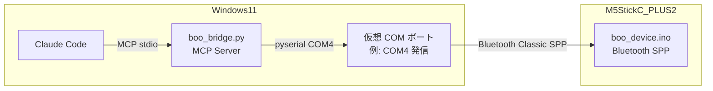
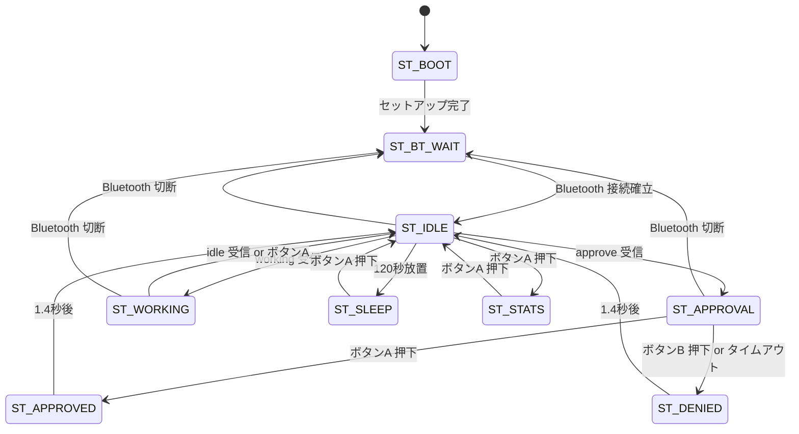

# プロダクト要求定義書

## 1. プロダクトビジョンと目的

M5StickC PLUS2 を使って Claude Code の危険な操作（ファイル削除・外部コマンド実行など）を
**物理ボタンで承認/否認**できるデバイスを作る。

単なる承認ボタンではなく、**たまごっち「ブー(Boo)」**として育てることで、
承認行動そのものをゲーム化し、セキュリティ意識を楽しく・継続的に高める。

> 参考: [@felixrieseberg の承認デバイス](https://x.com/felixrieseberg/status/2041249744828444991)  
> 本プロダクトはそのコンセプトを踏まえ、Bluetooth ワイヤレス接続とたまごっち育成要素を追加した実装。

---

## 2. スコープ

### In Scope（対象）

| カテゴリ | 内容 |
|----------|------|
| ハードウェア | M5StickC PLUS2 単体 |
| 接続方式 | Bluetooth Classic SPP（ワイヤレス） |
| 動作環境 | Windows 11 + WSL2 上の Claude Code |
| ブリッジ | Python MCP サーバー（WSL2 内で動作） |
| たまごっち | fed / energy / mood の 3 パラメータ管理 |

### Out of Scope（対象外）

| 内容 | 理由 |
|------|------|
| BLE (Bluetooth Low Energy) | SPP の方が COM ポート経由で扱いやすく、WSL2 から直接アクセス可能 |
| macOS / Linux ネイティブサポート | 初版は Windows 11 + WSL2 のみ |
| OTA ファームウェア更新 | Arduino IDE による手動書き込みで十分 |
| マルチデバイス（複数台接続） | 1 台で全承認フローをカバーできる |
| クラウド同期・スマホ連携 | ローカル完結を優先 |
| USB Serial 接続の廃止 | デバッグ用に USB Serial は残す（Bluetooth と並行動作） |

---

## 3. システムコンテキスト



### Windows 11 での Bluetooth 接続フロー

1. Windows 11 側で M5StickC PLUS2 をペアリング  
   → Windows が仮想 COM ポートを割り当て（発信側: 例 `COM4`）
2. Windows PowerShell 上の `boo_bridge.py` が `COM4` をシリアルポートとして開く
3. Claude Code が `boo_bridge.py` を MCP サーバーとして利用

> **重要制約**: Docker コンテナ（Dev Container）内からは BT 仮想 COM ポートにアクセスできない。  
> `boo_bridge.py` は **Windows PowerShell 上で直接実行**する必要がある。  
> Dev Container 経由での BT 通信は `/dev/ttyS*` マッピングが機能しないため不可。

---

## 4. ターゲットユーザーと課題・ニーズ

| 項目 | 内容 |
|------|------|
| ターゲット | Claude Code を日常的に使う開発者（初学者〜中級者） |
| 主な環境 | Windows 11 + WSL2 |
| 課題 | Claude Code が実行する危険操作を見逃しやすい |
| ニーズ | 画面から目を離していても物理的に承認/否認できる仕組み |
| 付加価値 | たまごっち風育成で飽きずに毎日使い続けられる |

---

## 5. ユーザーストーリー

### 必須（Must）

```
Story-01: 承認フロー
As a 開発者,
I want to Claude Code が危険操作を実行しようとするとき
  M5StickC PLUS2 の画面に内容が表示され、
So that 手元のボタンで承認/否認を返せる。
```

```
Story-02: ワイヤレス接続
As a 開発者,
I want to USB ケーブルを刺さずに Bluetooth で使いたい
So that デスクのケーブルを減らしてすっきりした環境で作業できる。
```

```
Story-03: 初回セットアップ
As a 初学者エンジニア,
I want to README の手順を読むだけでゼロからセットアップできる
So that Arduino や Python に詳しくなくても動かせる。
```

### 推奨（Should）

```
Story-04: 切断からの自動復帰
As a 開発者,
I want to Bluetooth 接続が切れたあと再接続待ちになってほしい
So that 接続切断のたびにデバイスを再起動しなくていい。
```

```
Story-05: 育成ゲーム
As a 開発者,
I want to 承認するたびにブーにご飯をあげられる
So that Claude Code の作業がゲームのように楽しくなる。
```

### あれば嬉しい（Could）

```
Story-06: 統計確認
As a 開発者,
I want to 今日の承認数・トークン使用量をデバイスで確認したい
So that Claude Code の作業量を体感できる。
```

---

## 6. 受け入れ条件

### 接続

| AC-ID | 条件 | 測定方法 |
|-------|------|---------|
| AC-CONN-01 | Windows 11 でペアリングして COM ポートが発行される | デバイスマネージャーで確認 |
| AC-CONN-02 | WSL2 から `/dev/ttyS<N>` で読み書きできる | `echo test > /dev/ttyS5` が通る |
| AC-CONN-03 | `boo_bridge.py --port /dev/ttyS5` で接続できる | `[boo] Connected` ログ確認 |
| AC-CONN-04 | Bluetooth 切断後 5 秒以内にデバイスが再接続待ちに戻る | 接続を強制切断して画面確認 |
| AC-CONN-05 | 再ペアリングなしに再接続できる（既ペアリング端末） | PC をスリープ復帰後に確認 |

### 承認フロー

| AC-ID | 条件 | 測定方法 |
|-------|------|---------|
| AC-APPR-01 | `approve_request` 呼び出しから画面表示まで 500ms 以内 | ストップウォッチ計測 |
| AC-APPR-02 | ボタンA で `{"approved":true}` が返る | MCP ツール呼び出し結果確認 |
| AC-APPR-03 | ボタンB で `{"approved":false}` が返る | MCP ツール呼び出し結果確認 |
| AC-APPR-04 | 30 秒放置で自動タイムアウト→否認 | タイムアウト後の戻り値確認 |
| AC-APPR-05 | danger=true のとき DANGER 顔と赤枠が表示される | 目視確認 |

### たまごっちパラメータ

| AC-ID | 条件 | 測定方法 |
|-------|------|---------|
| AC-TAMA-01 | 承認後に fed +2 されゲージが増える | ゲージ目視確認 |
| AC-TAMA-02 | 否認後に fed −1 されゲージが減る | ゲージ目視確認 |
| AC-TAMA-03 | スリープ中に energy が増加する | 2 分待機後にゲージ確認 |
| AC-TAMA-04 | 作業中（ST_WORKING）に energy が消費される | `notify_working` 後に確認 |

### 耐久・安定性

| AC-ID | 条件 | 測定方法 |
|-------|------|---------|
| AC-DUR-01 | 4 時間以上 Bluetooth 接続を維持できる | 長時間テストで確認 |
| AC-DUR-02 | 承認リクエストを 100 回連続送信しても応答が正常 | 自動テストで確認 |

---

## 7. 機能要件

### 7-1. Bluetooth 接続

| 要件ID | 優先度 | 内容 |
|--------|--------|------|
| CONN-01 | Must | Bluetooth Classic SPP で接続する（`BluetoothSerial` ライブラリ使用） |
| CONN-02 | Must | デバイス名は `BooDevice` とする |
| CONN-03 | Must | ペアリング PIN は `1234` とする |
| CONN-04 | Must | 接続が切れた場合、デバイス側は `ST_BT_WAIT` へ遷移して再接続待ちになる |
| CONN-05 | Must | USB Serial（115200bps）も同時に動作させる（デバッグ・開発用） |
| CONN-06 | Should | Bluetooth 接続中はインジケーター（`BT` マーク）を画面に表示する |

### 7-2. 通信プロトコル

通信は **JSON over Bluetooth SPP**（改行区切り）。

#### PC → デバイス

```json
{"type":"approve","tool":"Bash","details":"rm -rf /tmp","danger":false,"timeout":30}
{"type":"working","tool":"FileWrite"}
{"type":"idle"}
{"type":"tokens","total":328500,"today":267}
```

#### デバイス → PC

```json
{"approved":true}
{"approved":false}
```

### 7-3. 状態遷移



### 7-4. たまごっちパラメータ

#### fed（ご飯ゲージ）0〜8

| イベント | 変化量 |
|----------|--------|
| 承認（ボタンA） | +2.0 |
| なでる（アイドル中ボタンB） | +0.5 |
| 否認（ボタンB） | −1.0 |
| タイムアウト放置 | −2.0 |
| 自然減衰 | −0.15/分 |

#### energy（体力ゲージ）0〜6

| 状態 | 変化量 |
|------|--------|
| スリープ中 | +0.8/分 |
| アイドル中 | −0.05/分 |
| 作業中 | −0.4/分 |
| トークン 1K ごと | −0.02 |

#### mood（機嫌ゲージ）

```
mood = (fed/8 × 60%) + (energy/6 × 40%)  →  0〜8
```

### 7-5. ボタン操作

| 状態 | ボタンA | ボタンB |
|------|---------|---------|
| ST_BT_WAIT | — | — |
| ST_IDLE | 統計画面へ | なでる（fed +0.5） |
| ST_APPROVAL | 承認（fed +2） | 否認（fed −1） |
| ST_WORKING | アイドルへ | — |
| ST_SLEEP | 起動（napped 記録） | — |
| ST_STATS | アイドルへ | 統計リセット |

### 7-6. MCP ツール（boo_bridge.py）

| ツール名 | 引数 | 戻り値 | 説明 |
|----------|------|--------|------|
| `approve_request` | tool, details, danger, timeout | `{approved: bool}` | 承認リクエストを送信し結果を待つ |
| `notify_working` | tool_name | `{ok: true}` | 作業中を通知 |
| `notify_idle` | — | `{ok: true}` | アイドルを通知 |
| `update_tokens` | total, today | `{ok: true}` | トークン数を更新 |

---

## 8. 非機能要件

| カテゴリ | 要件 | 目標値 |
|----------|------|--------|
| レスポンス | ボタン押下 → JSON 送信 | 200ms 以内 |
| レスポンス | approve_request 呼び出し → 画面表示 | 500ms 以内 |
| 安定性 | Bluetooth 接続断後の再接続待ちへの遷移 | 5 秒以内 |
| 耐久性 | 連続動作時間（Bluetooth 接続維持） | 4 時間以上 |
| 省電力 | アイドル → スリープ遷移時間 | 120 秒放置後 |
| 表示 | 読みやすさ | フォントサイズ 1（CHAR_W=6px）で全情報が 135×240 に収まる |
| セットアップ | 初学者が README 通りに進めてゼロから動くまでの時間 | 60 分以内 |

---

## 9. セキュリティ考慮事項

| 項目 | 方針 |
|------|------|
| ペアリング認証 | PIN `1234` による Bluetooth Classic ペアリング（固定 PIN） |
| 信頼スコープ | ペアリング済み PC のみ接続可能（Bluetooth の物理的近接性で制限） |
| 自動承認防止 | デバイス側ボタン操作のみで承認可能。ソフトウェアからの自動承認は設計上不可能 |
| 通信内容 | ツール名・詳細を画面に表示し、ユーザーが内容を見てから承認する設計 |
| リスク受容 | PIN `1234` は弱い。物理的に手の届く範囲での使用を前提とするため許容する |

---

## 10. エラーケースと対応方針

| エラーケース | デバイス側の挙動 | ブリッジ側の挙動 |
|-------------|----------------|----------------|
| Bluetooth 切断（承認リクエスト中） | ST_BT_WAIT へ遷移。承認結果は未送信のまま | `asyncio.TimeoutError` として `approved=false` を返す |
| Bluetooth 切断（アイドル中） | ST_BT_WAIT へ遷移し再接続待ち | 接続エラーをログ出力、再接続試行 |
| 承認リクエストが連続で届く（キュー） | 先着 1 件を処理中は後続を無視（ST_APPROVAL 中は新規 approve を受け付けない） | MCP 呼び出し元がタイムアウトで失敗 |
| デバイスの電源断 | — | Serial 読み込みエラー → ログ出力 → 再接続試行 |
| JSON 不正形式 | `deserializeJson` 失敗時は無視（処理継続） | 送信前に Python 側で JSON バリデーション済み |
| `boo_bridge.py` が COM ポートを見つけられない | — | エラーメッセージを出力して `sys.exit(1)` |

---

## 11. ハードウェア制約（ESP32-PICO-V3-02）

| 項目 | スペック | 設計上の制約 |
|------|---------|-------------|
| SRAM | ~520KB | JSON バッファは 512 バイト以内 |
| Flash | 4MB | BT Classic スタック ~1.2MB を含む。Huge APP (3MB) パーティションを使用 |
| Bluetooth | Classic 4.2 (SPP 対応) | BLE は使用しない |
| ディスプレイ | 135×240 TFT (ST7789V2) | フォントサイズ 1 で 22 文字×30 行 |
| バッテリー | 約 120mAh | スリープ活用で 4 時間以上を目指す |
| ボタン | A（正面）/ B（側面） | 2 ボタンで全操作をカバー |

---

## 12. 優先度（MoSCoW）

| 優先度 | 機能 |
|--------|------|
| **Must** | Bluetooth SPP 接続、承認/否認フロー、fed/energy/mood 管理、ST_BT_WAIT 状態 |
| **Should** | 再接続自動復帰、Bluetooth 接続インジケーター、USB Serial 並行動作 |
| **Could** | 統計リセット機能、なでる機能、詳細なアイドルアニメ |
| **Won't** | BLE、マルチデバイス、OTA 更新 |

---

## 13. リスクと対応策

| リスク | 影響度 | 発生確率 | 対応策 |
|--------|--------|---------|--------|
| WSL2 で `/dev/ttyS<N>` が書き込めない | 高 | 中 | `sudo chmod 666 /dev/ttyS<N>` または `dialout` グループ追加で解決 |
| COM ポート番号が変わる | 中 | 低 | `--port` オプションで明示指定、README に手順を記載 |
| Bluetooth 接続が不安定 | 高 | 中 | 再接続ロジック（指数バックオフ）実装、接続エラーをログ出力して自動リトライ |
| ESP32 BT + ディスプレイ同時使用での電力スパイク | 中 | 低 | `setBrightness` を低めに設定（160/255） |
| Arduino `BluetoothSerial` ライブラリのバッファオーバーフロー | 高 | 低 | JSON メッセージを 200 バイト以内に制限 |
